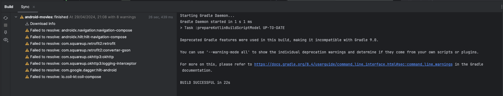
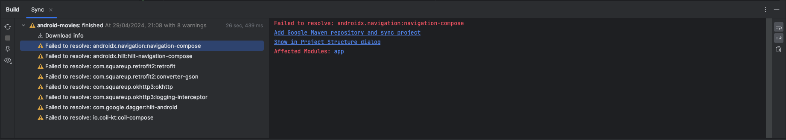

# Issues

This document serves to showcase all the issues that were encountered, and for some reason I thought
that it would be beneficial to document.

## 1. Dependencies

After creating the project I tried to add several packages that I knew that would be necessary.
Upon doing so, I faced some issues until I got the following which took the most time to solve.

### Problem

Sync Project with Gradle Files would throw the following warning.

More on detail, once I pressed an item of the failed list, I could see that I was getting
a `Failed to resolve`.

### Solution

In order to fix this issue, I had to set a specific version for the package that couldn't be found. 

